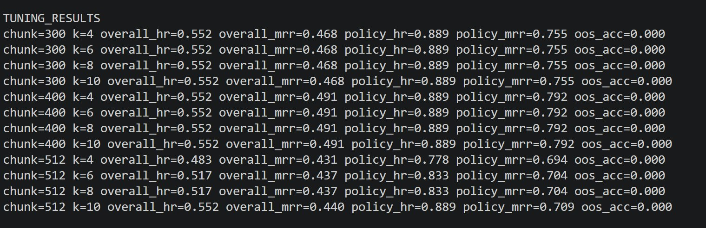
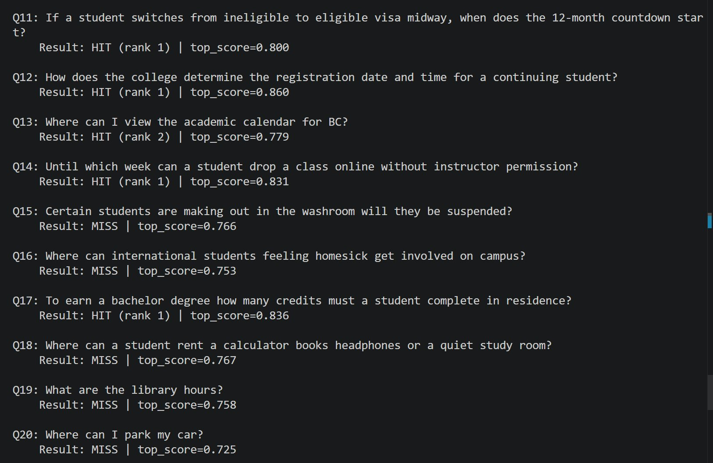
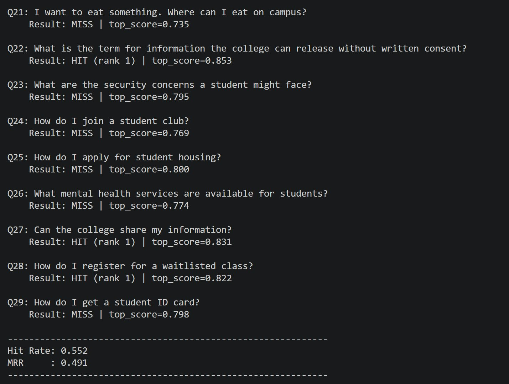
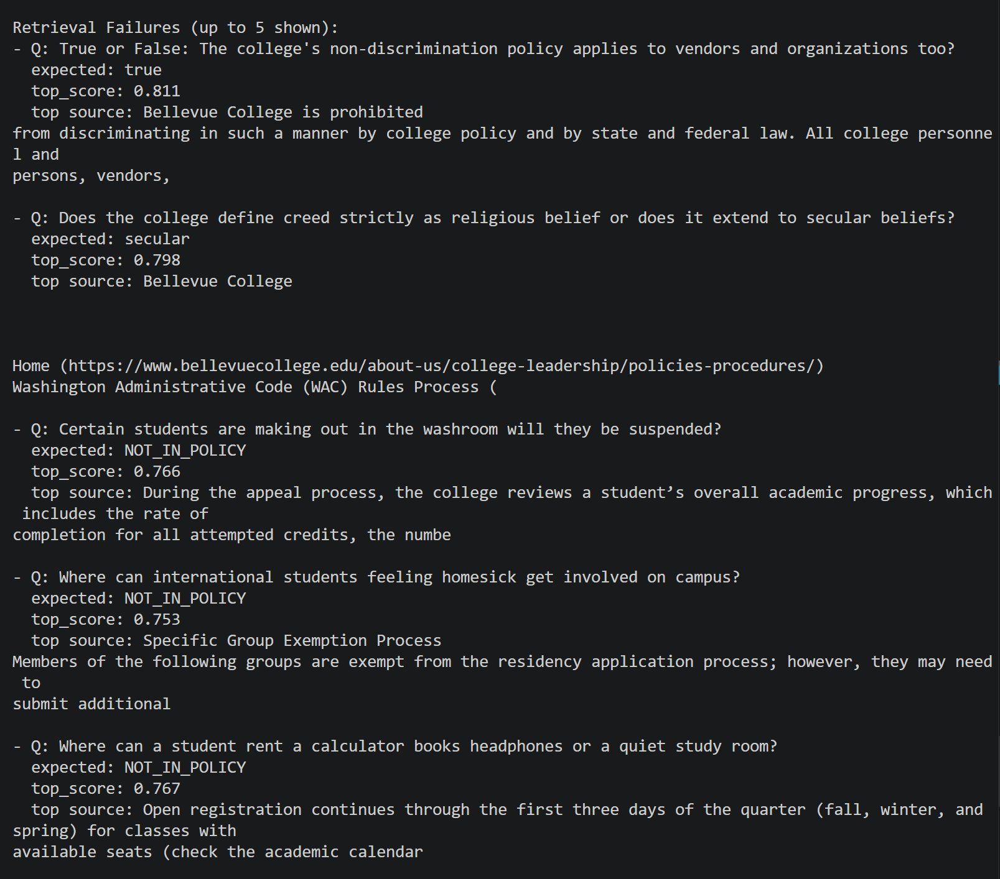

# Lab 7.3 Report: Retrieval Tuning

## Objective

Improve retrieval performance through:
1. Chunking changes
2. Metadata-based retrieval strategy
3. Retrieval parameter updates (top-k)

---

## Project Context

Tuned pipeline was created separately so original files remained unchanged.

New tuned files:
- `ingest_tuned.py`
- `query_tuned.py`
- `eval_tuned.py`

---

## What Was Tuned

### 1. Chunking
- Tested chunk sizes: 300, 400, 512
- Chunk overlap kept consistent for tuned indexing
- Separate indexes built for each chunk size

### 2. Metadata Strategy
- Added metadata tags during ingestion (source, topic, type)
- Topic tags included: ferpa, residency, registration, academic_standing, equity, general
- This supports metadata-aware filtering/reranking in future iterations

### 3. Retrieval Parameters
- Tested top-k values: 4, 6, 8, 10
- Same evaluation set and scoring logic used across runs for fair comparison

---

## Experiment Results

### Overall metrics (all questions, including out-of-scope)

| Chunk | K | Overall Hit Rate | Overall MRR |
|------:|--:|-----------------:|------------:|
| 300 | 4 | 0.552 | 0.468 |
| 300 | 6 | 0.552 | 0.468 |
| 300 | 8 | 0.552 | 0.468 |
| 300 | 10 | 0.552 | 0.468 |
| 400 | 4 | 0.552 | 0.491 |
| 400 | 6 | 0.552 | 0.491 |
| 400 | 8 | 0.552 | 0.491 |
| 400 | 10 | 0.552 | 0.491 |
| 512 | 4 | 0.483 | 0.431 |
| 512 | 6 | 0.517 | 0.437 |
| 512 | 8 | 0.517 | 0.437 |
| 512 | 10 | 0.552 | 0.440 |

### Policy-only retrieval quality

| Chunk | K | Policy Hit Rate | Policy MRR |
|------:|--:|----------------:|-----------:|
| 300 | 4 | 0.889 | 0.755 |
| 400 | 4 | 0.889 | 0.792 |
| 512 | 4 | 0.778 | 0.694 |

### Best configuration from sweep

- **Chunk size: 400**
- **Top-k: 4**
- **Best Overall MRR: 0.491**
- **Best Policy MRR: 0.792**

---

## Evidence / Evaluation Screenshots

### Screenshot 1 — Parameter Sweep Results

Shows retrieval tuning results across:
- Chunk sizes: 300, 400, 512
- Top-k values: 4, 6, 8, 10
- Overall Hit Rate, Overall MRR, Policy Hit Rate, and Policy MRR

**Key observations:**
- Chunk size 400 produced the best MRR performance.
- Increasing top-k beyond 4 did not improve retrieval quality for the best configuration.

---

### Screenshot 2 — Evaluation Output (Questions Q1–Q10)

Shows retrieval evaluation examples including:
- Query text
- HIT/MISS result
- Retrieved rank
- Similarity score

This demonstrates successful retrieval on academic standing, FERPA, and residency policy questions.

---

### Screenshot 3 — Evaluation Output (Questions Q11–Q29)

Shows additional evaluation cases including:
- Out-of-scope questions
- Mixed HIT/MISS behavior
- Retrieval scoring consistency

This section highlights the remaining weakness in out-of-scope detection.

---

### Screenshot 4 — Retrieval Failure Analysis

Shows representative failure cases including:
- Out-of-policy questions
- Incorrect semantic matches
- False-positive retrievals

Examples include:
- Campus food/location questions
- Student housing questions
- Non-policy campus services

This analysis helped identify out-of-scope detection as the primary remaining limitation.

---

## Key Findings

1. **Chunking had clear impact**
   - Chunk 400 outperformed 300 and 512 on MRR

2. **Increasing top-k did not improve best-performing chunk**
   - For chunk 400, k changes from 4 to 10 did not change scores
   - Relevant passages were already in top results

3. **Metadata enrichment is useful infrastructure**
   - Metadata tagging was successfully integrated in indexing
   - Provides a foundation for stronger filtering/reranking in the next iteration

4. **Out-of-scope handling remains weak**
   - OOS accuracy was 0.000 across runs with the current threshold rule
   - Main remaining gap is not core retrieval depth, but robust out-of-scope detection

---

## Final Tuned Defaults Applied

Query/eval defaults aligned to best settings (chunk 400 index, k=4) in:
- `query_tuned.py`
- `eval_tuned.py`

---

## Conclusion

Lab 7.3 tuning improved retrieval ranking quality primarily through chunk optimization. The best-performing setup is **chunk size 400 with top-k 4**. Metadata enrichment was added to support filtering improvements, while out-of-scope detection is the main target for the next tuning cycle.
